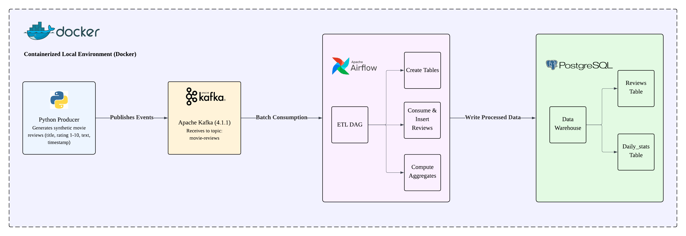

# Local Movie Reviews ETL Pipeline



This project is part of my public data engineering portfolio running on local machine.

Although I have Cloud Engineering skills, I wanted to have a deep understanding of Data Engineering tools and concepts locally before replicating in the cloud. I decided to build simple projects like this one to simulate real-world data engineering flow using a fully containerized, reproducible environment. I intentionally kept the scope small and containerized to focus on the core concepts of using the tools (Apache Kafka, Apache Airflow, PostgreSQL) in a data engineering pipeline rather than battling with infrastructure setup.

At a high level, the system generates movie review events, streams them through Kafka, orchestrates processing with Apache Airflow(which is intentionally used as a consumer), and stores structured results in PostgreSQL — all running locally with Docker Compose.

## Project Scope

This project focuses on ingestion, processing, and aggregation of streaming data.

It simulates processes that:

- Generate events as live events
- Streames it reliably through a message broker
- A scheduled workflow processes and aggregates the data
- Clean, structured results are stored in a database

It does NOT include:

- Real-time dashboards
- Historical ranking comparisons
- Advanced analytics layers
- Complex network configurations
- Infrastructure setup

## Architecture Overview

This pipeline demonstrates the classic **producer → message broker → orchestrator → sink** pattern:

1. **Python Producer** generates synthetic movie reviews (title, rating 1–10, text, timestamp) and publishes to Kafka
2. **Apache Kafka** (4.1.1 KRaft mode) acts as the reliable message broker
3. **Apache Airflow** (2.10.5) orchestrates the ETL workflow via a DAG:
   - Creates target tables (if needed)
   - Consumes messages from Kafka in batches
   - Inserts raw reviews into PostgreSQL
   - Computes aggregates (avg rating + count per movie) into a stats table
4. **PostgreSQL** (16) serves as the data warehouse with `reviews` and `daily_stats` tables

## Features

✅ **Fully Automated Setup** - One command to start everything  
✅ **Zero Manual Configuration** - Permissions, connections, and DB migrations handled automatically  
✅ **Portable** - Runs on any system with Docker and Docker Compose  
✅ **End-to-End Pipeline** - From event generation to data warehousing

## Tech Stack

- **Apache Kafka** 4.1.1 (KRaft mode, single broker)
- **Apache Airflow** 2.10.5 (with PostgreSQL backend)
- **PostgreSQL** 16 (data warehouse and Airflow metadata)
- **Python** 3.12 with kafka-python
- **Docker** & **Docker Compose** for containerization

## Prerequisites

- **Docker** (20.10+)
- **Docker Compose** (2.0+)
- **Git** (to clone the repository)

**No manual installations of Kafka, Airflow, or PostgreSQL required.**

## Quick Start

### 1. Clone the Repository

```bash
git clone https://github.com/yourusername/Local-Movie-Reviews-ETL-Pipeline.git
cd Local-Movie-Reviews-ETL-Pipeline
```

### 2. Start the Environment and the Pipeline

```bash
docker compose up -d
```

This single command will:

- Create and configure all necessary directories with correct permissions
- Start Kafka broker with proper internal/external listeners
- Initialize PostgreSQL database
- Run Airflow database migrations
- Create the `postgres_default` Airflow connection automatically
- Start Airflow webserver and scheduler
- Produce 50 sample movie reviews to Kafka
- Airflow Ingest the Data into Posgres

**Wait ~60-90 seconds** for all services to become healthy and completed.

### 3. Access Airflow UI

Open your browser to: **http://localhost:8080**

- **Username**: `admin`
- **Password**: `admin`

### 4. Confirm DAG was Triggered

1. In the Airflow UI, find the DAG: `movie_reviews_etl`
2. Toggle it **ON** (if not already enabled)
3. Click on `movie_reviews_etl` DAG to open it
4. Click on the **Graph View** to see the DAG flow
5. You should see 3 green tasks.

### 5. Verify Results

Check the data in PostgreSQL:

```bash
docker exec -it postgres-db psql -U airflow -d airflow_db
```

Run queries:

```sql
-- View raw reviews
SELECT * FROM reviews LIMIT 10;

-- View aggregated statistics
SELECT * FROM daily_stats ORDER BY review_count DESC;

-- Exit
\q
```

## Project Structure

```
Local-Movie-Reviews-ETL-Pipeline/
├── dags/
│   └── movie_reviews_pipeline.py    # Airflow DAG definition
├── scripts/
│   ├── produce_reviews.py           # Kafka producer script
│   └── wait_for_kafka.py            # Kafka connection health check
├── logs/                             # Airflow logs (auto-created, git-ignored)
├── docker-compose.yml                # Service orchestration
├── Dockerfile                        # Custom Airflow image
├── requirements.txt                  # Python dependencies
├── .gitignore                        # Git ignore rules
└── README.md                         # This file
```

## Services

| Service           | Port | Description                          |
| ----------------- | ---- | ------------------------------------ |
| Kafka (Internal)  | 9092 | Kafka broker for Docker services     |
| Kafka (External)  | 9094 | Kafka broker for host machine        |
| Airflow Webserver | 8080 | Airflow UI                           |
| PostgreSQL        | 5433 | Database (mapped to avoid conflicts) |

## Stopping the Environment

### Stop all services (keeps data):

```bash
docker compose down
```

### Stop and remove all data (fresh start):

```bash
docker compose down --volumes
```

## DAG Details

The `movie_reviews_etl` DAG performs the following tasks:

1. **create_tables**: Creates `reviews` and `daily_stats` tables if they don't exist
2. **consume_and_insert**: Reads messages from Kafka and inserts into `reviews` table
3. **aggregate_stats**: Computes per-movie statistics (avg rating, review count) into `daily_stats`

**Dependencies**: `create_tables` → `consume_and_insert` → `aggregate_stats`

### Modifying the DAG

Edit `dags/movie_reviews_pipeline.py` and the changes will be picked up automatically (DAG refresh interval is ~30s).

## About the Author

Built by **Idris Busari** is a Certified Google Professional Data Engineer with over 20 years of cross-industry experience spanning retail, food and beverage, and the public sector. He designs and implements scalable data architectures that integrate fragmented systems into reliable, production-grade pipelines.

His expertise covers data modeling, ETL/ELT pipeline development, cloud-native infrastructure, automation, and governance. With a strong foundation in accounting and business operations, he approaches engineering with a systems mindset — ensuring that data platforms are not only technically sound but aligned with measurable business outcomes.

His guiding principle remains: **"Data doesn’t lie."**

Connect with Idris:

- LinkedIn: https://www.linkedin.com/in/idris-busari-ohunilu
- X: https://x.com/ohunilu
